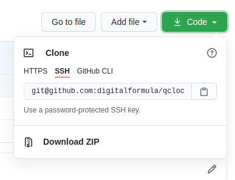
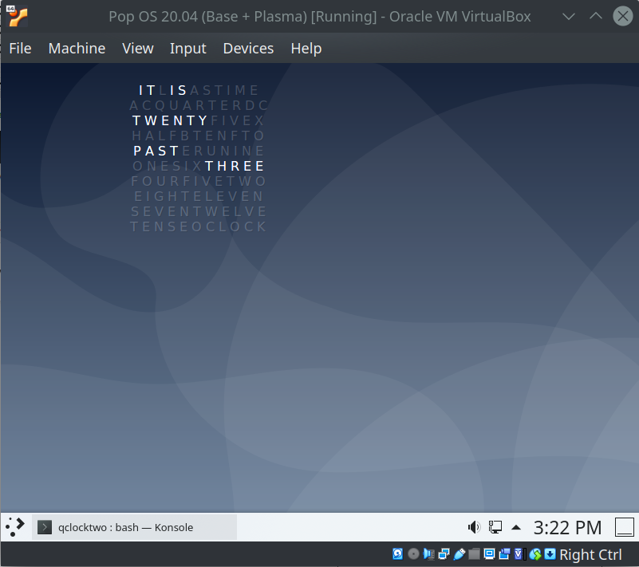

# QClockTwo for Conky

No credit to me for creating the original artwork or Conky theme.  Original artwork created by [mowgli-writes on DeviantArt](https://www.deviantart.com/mowgli-writes/art/qlocktwo-conky-470067388).

I just created an updated version of `.conkyrc` that doesn't throw errors on later versions of Conky.

## Usage

I'm on Pop OS (Ubuntu variant) with the K Desktop Environment (KDE), although these instructions *should* work on any Ubuntu variant.

- Install Conky:

  ```
  sudo apt-get install conky
  ```

- Either:

  - Open the `qclocktwo` file in this repo, making sure you open the **raw** version
  - **or** download the entire repository using the GitHub download option:

    

- Copy/move/save the `qclocktwo` file as `.conkyrc` in your user's home directory i.e. `~/.conkyrc`
- Open a terminal and run Conky:

  ```
  conky &
  ```

  (the `&` runs Conky as a background process)

- Conky should run, with the `qclocktwo` theme displayed at the top left of your screen

  

- If you want to change the position of the `qclocktwo` widget, edit `~/.conkyrc` and look for the following settings:

  - alignment
  - gap_x
  - gap_y

- Conky should detect changes in `~/.conkyrc` and reload when the file is saved
